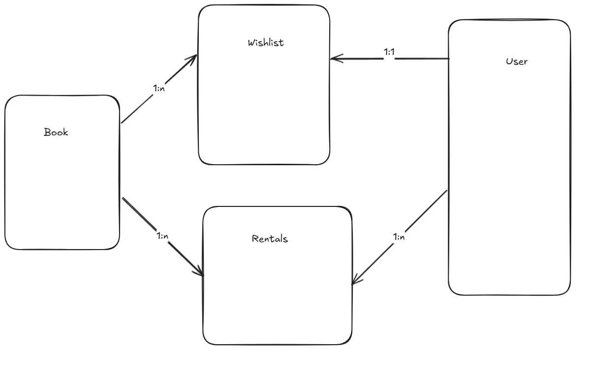

# LibraryApp

Application handles book loans for a small local library

## Architecture

Database has tables
- Book
- User
- Wishlist
- Rentals

Entry in the Rentals table assumes that book has been borrowed already. No record for given book in that table indicates that book is available. 

Before Rental entry is created, only first wishlist for a given book among users is considered to allow borrowing given book by dropping found wishlist.

If they are no associated wishlist for given borrowed book, all Rentals are removed indicating that this book is ready to be borrowed and 
owners of Wishlists linked to given book are notified.

Ultimate requirement to obtain a Rental for a user is to have a Wishlist entry for a desired book.

## Technologies

- Python
- Flask
- Flask-sqlalchemy
- Pandas
- Flasgger
- Poetry

## How run project

Project uses poetry as a dependency management. 

Run `poetry install` in the catalog to install dependencies.

1) Spin up container via docker-compose

`docker compose up --build`

Connect to the container to check database content

`docker exec -it libraryapp bash`

`sqlite3 /usr/src/app/app/db/data/database.db`

While using sqlite3 run

- `.tables` to list tables
- `.schema` to list schemas
- `.schema User` to list User table
- `.quit` to quit

2) Run it locally in IDE by running `main.py`

## Endpoints

By defaults application redirects to Swagger endpoint

### Books

Search books by title or author (GET)
- `/v1/books?title=&author=year=?`

### Users

Create users (POST)
- `/v1/users/{user_name}/{user_type}`

### Reports

Create report of books by rental status and days for how long they were rented for (GET)
- `/v1/reports/amount/{status}`

### Wishlists

Create wishlist (POST)
- `/v1/wishlists/{user_name}/{book_id}`

Delete wishlist (DELETE)
- `/v1/wishlists/{user_name}/{book_id}`

### Rentals

Change the rental status of a book (POST)
- `/v1/rentals/{book_id}`

## User types

- User
- Staff

## Swagger

http://localhost:5000/apidocs

## Dev

Activate venv via ` .\.venv\Scripts\activate` or `Invoke-Expression (poetry env activate)` to
- run code formatting via `black .`
- run unit tests via `pytest`
- run type hints checking via `mypy .`
